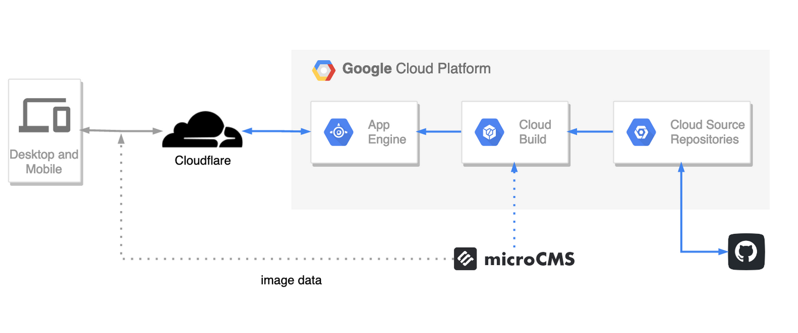

# Blog Project

This is a [Next.js](https://nextjs.org/) project bootstrapped with [`create-next-app`](https://github.com/vercel/next.js/tree/canary/packages/create-next-app).

## Getting Started

First, run the development server:

```bash
PORT=3000 yarn dev
```

Open [http://localhost:3000](http://localhost:3000) with your browser to see the result.

## Architecture



## API Endpoints

You can find in the [`api-endpoints.md`](docs/api-endpoints.md) file the list of all the API endpoints.

---

## Learn More

To learn more about Next.js, take a look at the following resources:

- [Next.js Documentation](https://nextjs.org/docs) - learn about Next.js features and API.
- [Learn Next.js](https://nextjs.org/learn) - an interactive Next.js tutorial.

You can check out [the Next.js GitHub repository](https://github.com/vercel/next.js/) - your feedback and contributions are welcome!
